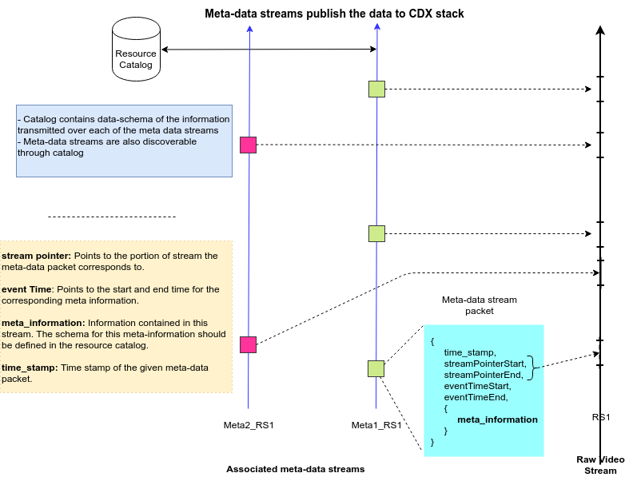

Media Data Exchange
===================

Cameras are amongst the key data resources for smart cities. They have the potential to enable smart applications that touch almost all aspects of daily urban life; automated surveillance, intelligent transport management systems, traffic management systems, smart parking systems, infrastructure monitoring to name a few.  For example, networked IP cameras can be used to collect real-time data about vehicle counts, road congestions, accidents, vehicle breakdowns etc., which can help city officials manage the traffic better. The same video streams can be used to collect live road-side parking data that can provide better parking management systems. Further, the same camera feeds can aid security aspects by providing data about crowd build up etc. and help officials react faster to a growing situation in real time.

Currently, various smart city applications are operating as vertical silos with very little cooperation amongst each other. This problem is especially acute when it comes to sharing of video data. For example, the police department may have thousands of cameras across the city for surveillance, the traffic police may have hundreds of cameras at traffic junctions for traffic management and the transport department may have several cameras in bus-fleets, depots etc. with no way of sharing data with each other and/or with other public or private smart city ecosystem partners. Further, there may be many private producers of data that may be of interest to smart city operations, e.g., privately owned campus cameras, car fleet videos, public shopping arena videos etc. Sharing video data and the corresponding meta-data across various public/private entities will help break these silos and enable efficient and cost-effective operations.

One can view the combination of raw video/audio stream and corresponding analytics software as an intelligent sensor conveying specific information summarized from the input media content. Such meta-data streams containing data summaries are highly desirable as it allows downstream applications to avoid looking at raw media streams. In addition,  one can use the meta-media streams to “correlate” data across multiple such and other IoT streams available from various entities present in a given spatial or temporal space. Sharing media data and the associated meta-media streams will accelerate ushering in an era of  futuristic AI applications for smart cities.

To enable multiple such new applications, and especially by a multiplicity of different solution providers, it is critical that smart cities adopt an API based, platform approach towards exchanging and consuming video and media meta-data, similar to those for IoT data.

The following are the key requirements to create such a platform:

        - [Media Meta-Data] A framework that supports associating a meta-data stream to raw media streams, that contain additional information of relevance to the semantic content of the raw media stream,          and that enables easy discovery and additional value creation by downstream analytics applications.
 
        - [Media Data Exchange] An  API based, scalable, media data exchange platform, that allows for:

                - Easy discovery of media resources
                - Secure, authenticated, privacy preserving and accountable access for consuming live and archived media streams
                - Secure, authenticated and accountable access for supplying live and archived media streams

                
Meta Information for Video (and Media) streams
----------------------------------------------

Value of data grows in proportion to the number of people who can use it. One critical necessary condition for successful usage of data, is availability of meta-data - i.e. data about the data. Example meta information include: time when data was captured, location from where it was captured, pose of the camera, etc. Such meta information adds a lot of value to the data itself and makes it easier to analyze. While the exact meta-data is application dependent and cannot be dictated in general, one can create a standard framework within which to capture and report the meta-data of media streams like video, audio etc. While many encoding formats already capture some meta-information, they are mostly about the encoding aspects. In addition to those, from  the perspective of analytics especially, it is very useful to also have meta-data that is about the semantic content of the streams. This meta-data stream is adjoint (in parallel to) to the raw media stream as depicted in Figure 1.  Some examples of meta-data content streams include:

        - GPS/Pose time series data attached to media data for mobile media sources (e.g. for video streams from drones)
        - Time series data of specific objects and their bounding boxes (e.g. times and number of diesel vehicles at a particular junction)
        - Time series data about certain events (e.g. cows crossing the road)
        - Semantic summary of the entire stream (e.g. live stream of an accident at south end '*'circle)

These meta-data streams can be generated by video-analytic softwares or by an agent that has access to other sensors. A key idea is to treat these meta-data streams also as any other IoT sensor stream. That is, these can be consumed via the platform and have an associated data-schema (that describes what information is contained in the stream) and this schema is stored in the resource catalog.

Figure 1 : IoT view of video data 

An example schema for meta-information for a mobile camera is given below ::

    {
    "refCatalogueSchema": "meta-media-schema.json",
    "id": "Meta1_RS1",//Unique Identifier for this Meta-Media stream
    "resourceType": "meta-media stream",
    "sourceId": "RS1", //Unique Identifier for source Media stream for which this meta  stream is for”
    "tags": [
      "drone",
      "Camera",
      "Position"
    ],
    "refCatalogueSchemaRelease": "0.1.0",
    "Description": "Meta information for camera feed from Drone 80b3d58ff003AAe5"
    "owner": {
       "name": "IISC",
       "website": "http://www.iisc.ac.in"
    },
    "provider": {
       "name": "Robert Bosch Centre for Cyber Physical Systems, IISc",
       "website": "http://rbccps.org"
    },
    "data_schema": {
    	"type": "object",
    	"properties": {
     	"onboard_analytics_msg": {
       	"type": "object",
       	"direction": "from-device",
       	"access-modifier": "public",
       	"tags": ["smoke detection", "location"],
       	"properties": {
          	  "timestamp": {
                  "type": "number",
                  "description": "Time in EPOCH format",
                  "units": "milliseconds"
          	  },
          	  "streamPointerStart": {
                  "type": "number",
                  "description": "ptr into the start of the media stream portion for this meta info"
          	  },
              "streamPointerEnd": {
                  "type": "number",
                  "description": "pointer into the end of the media stream portion for this meta info"
          	  },
          	  "eventTimeStart": {
           	    "type": "number",
           	    "description": "Start time for this meta info in EPOCH format"
          	  },
          	  "eventTimeEnd": {
           	     "type": "number",
           	     "description": "End time for this meta info in EPOCH format"
          	  },
          	  "latitude": {
                 "type": "number",
                 "description": "latitude as per WGS84",
                 "ontologyRef": "http://www.w3.org/2003/01/geo/wgs84_pos#",
                 "units": "degrees"
              },
          	  "longitude": {
                 "type": "number",
                 "description": "latitude as per WGS84",
                 "ontologyRef": "http://www.w3.org/2003/01/geo/wgs84_pos#",
                 "units": "degrees"
          	  },
          	  "smoke_detected": {
                 "type": "boolean",
                 "description": "Indicates if the smoke is detected in the video stream or not "
          	  }
       	}
         }
       }
    }
    } 

Table 1: Schema to describe a Meta Video Stream which gives additional information about the geolocation of the camera at various time instances.

As shown in Table 1, the meta-media stream packets may contain broadly the following fields (in the dataobject section)

        - timestamp:  The time stamp at the time of packet generation in a pre-specified epoch
        - streamPointerStart, streamPointerEnd: These fields provide a linkage to the source video stream. It specifies the parts of video stream this particular meta-data packet pertains to. These fields provide synchronization across various meta-information streams that are linked to the same video and will also help overlay meta-information with the display contents of the video. Further, it can help validation of meta-information that is generated by analytics software.
        - eventStartTime, eventEndTime: These fields provide time indication for the start and end of the event/information described in this data packet.
        - Meta-information fields: These contain the actual meta-information. 

For the example of a flying UAV sending raw video data to the platform, since, the location of UAV is continuously changing it will be hard to ascertain the position of camera just by looking at the raw stream. However, the UAV can use its onboard GPS sensor and generate a meta-data stream which provides information about the position of UAV as time series data (Table 2) ::

    "Onboard_analytics_msg": { "timestamp”:987565432768,"streamPointerStart":234615,"streamPointerEnd":234616,"latitude":13.013846,"longitude":77.570311, "smoke_detected": TRUE
    }
    "Onboard_analytics_msg": { "timestamp":987565432769,"streamPointerStart":234617,"streamPointerEnd":234618,"latitude":13.023846,"longitude":77.571311, "smoke_detected": TRUE
    }

Table 2: Example snippets from a meta-data stream for a mobile camera source like a drone

Media Data Exchange
-------------------

